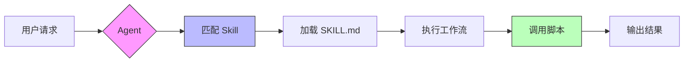
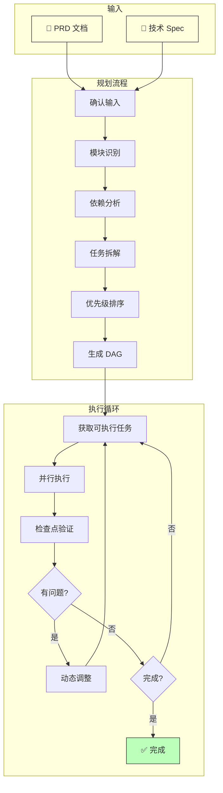
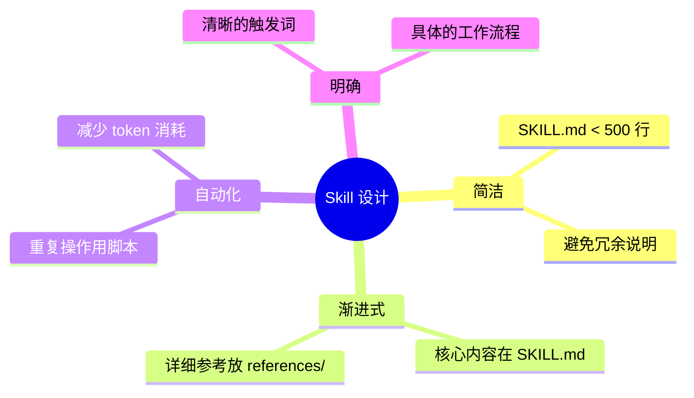

# SDDPRO Skills

[](https://opensource.org/licenses/MIT)
[](#已有-skills)
[](https://cursor.sh)
[](https://github.com/Coldplay-now/sddproskills/pulls)

> **SDD** = **S**pec **D**riven **D**evelopment（规格驱动开发）
> 
> 以 PRD 和技术规格文档为核心驱动，通过 AI Agent 实现高效、可追溯的软件开发流程。

个人开发的 Cursor/Claude Agent Skills 集合，用于扩展 AI 编程助手的能力。

## 什么是 Skill？

Skill 是模块化的知识包，可以让 AI Agent 掌握特定领域的工作流程和专业知识。



每个 Skill 包含：
- **SKILL.md** — 主文件，定义触发条件和工作流程
- **scripts/** — 辅助脚本，提供确定性的自动化能力
- **test/** — 示例和测试用例（可选）

## 已有 Skills

### 📋 task-planner

**项目规划和任务编排工具** — 基于 SDD 理念的核心 Skill

根据 PRD 和技术 Spec 文档，通过引导式问答帮助制定开发计划：



#### 核心特性

| 特性 | 说明 |
|------|------|
| 📝 引导式问答 | 6 阶段流程，逐步确认需求 |
| 🔀 DAG 生成 | 自动分析依赖，生成任务拓扑图 |
| 🚀 多 Agent 并行 | 支持最多 4 个 Agent 并行开发 |
| ✅ 检查点机制 | 每轮执行后验证产出 |
| 🔄 动态调整 | 失败时自动插入修复任务 |

#### 目录结构

```
taskplanner/
├── SKILL.md              # 主文件
├── scripts/              # 辅助脚本
│   ├── validate_dag.py   # DAG 验证
│   ├── next_task.py      # 获取可执行任务
│   ├── claim_task.py     # 认领任务
│   ├── complete_task.py  # 完成任务
│   ├── reset_task.py     # 重置任务
│   ├── checkpoint.py     # 检查点验证
│   └── replan.py         # 动态调整
└── test/                 # 示例项目
    ├── PRD.md            # 示例产品文档
    ├── Spec.md           # 示例技术规格
    ├── TASKS.md          # 生成的任务计划
    ├── backend/          # 生成的后端代码
    └── frontend/         # 生成的前端代码
```

#### 脚本说明

| 脚本 | 功能 | 用法 |
|------|------|------|
| `validate_dag.py` | 验证任务 DAG 无循环依赖 | `python validate_dag.py TASKS.md` |
| `next_task.py` | 获取当前可执行的任务列表 | `python next_task.py TASKS.md` |
| `claim_task.py` | 认领任务，自动生成会话 ID | `python claim_task.py TASKS.md TASK-001` |
| `complete_task.py` | 标记任务完成或失败 | `python complete_task.py TASKS.md TASK-001 [--failed]` |
| `reset_task.py` | 重置任务为 pending 状态 | `python reset_task.py TASKS.md TASK-001` |
| `checkpoint.py` | 执行检查点，验证产出物 | `python checkpoint.py TASKS.md <项目目录>` |
| `replan.py` | 动态调整任务计划 | `python replan.py TASKS.md --suggest` |

#### 触发词

`项目规划` · `任务拆解` · `开发计划` · `PRD 分析` · `模块依赖`

## 安装使用

### 方式一：个人 Skill（推荐）

将 skill 复制到 Cursor 个人 skills 目录：

```bash
# 复制 task-planner skill
cp -r taskplanner ~/.cursor/skills/task-planner
```

### 方式二：项目 Skill

将 skill 复制到项目 `.cursor/skills/` 目录：

```bash
mkdir -p .cursor/skills
cp -r taskplanner .cursor/skills/task-planner
```

## Skill 开发规范

### 目录结构

```
skill-name/
├── SKILL.md              # 必需：主文件
├── scripts/              # 可选：辅助脚本
├── references/           # 可选：参考文档
├── assets/               # 可选：资源文件
└── test/                 # 可选：测试用例
```

### SKILL.md 格式

```markdown
---
name: skill-name
description: 描述这个 skill 做什么，以及什么时候应该使用它
---

# Skill Name

## 工作流程
...

## 辅助脚本
...
```

### 最佳实践



## 贡献

欢迎提交新的 Skill 或改进现有 Skill：

1. Fork 本仓库
2. 创建新 skill 目录
3. 编写 SKILL.md 和辅助脚本
4. 添加测试用例（推荐）
5. 提交 Pull Request

## License

MIT
