# SDDPRO Skills

[](https://opensource.org/licenses/MIT)
[](#skill-规划)
[](https://cursor.sh)
[](https://github.com/Coldplay-now/sddproskills/pulls)

> **SDD** = **S**pec **D**riven **D**evelopment（规格驱动开发）
> 
> 以 PRD 和技术规格文档为核心驱动，通过 AI Agent 实现高效、可追溯的软件开发流程。

这是一套完整的 SDD 工具链 Skills 集合，覆盖从需求设计到代码实现的全流程。

## SDD 工具链全景

```mermaid
flowchart LR
    subgraph 设计阶段
        A[💡 需求想法]
        B[📄 PRD]
        C[📐 Tech Spec]
        D[🎨 UI Design]
    end
    
    subgraph 规划阶段
        E[📋 Task Plan]
        F[🔀 DAG]
    end
    
    subgraph 执行阶段
        G[🤖 Multi-Agent]
        H[✅ Checkpoint]
        I[🚀 Product]
    end
    
    A -->|prd-designer| B
    B -->|spec-designer| C
    B -->|ui-designer| D
    C --> E
    D --> E
    E -->|task-planner| F
    F --> G
    G --> H
    H --> I
    
    style A fill:#fff,stroke:#333
    style B fill:#ffd,stroke:#333
    style C fill:#ffd,stroke:#333
    style D fill:#ffd,stroke:#333
    style E fill:#ddf,stroke:#333
    style F fill:#ddf,stroke:#333
    style I fill:#bfb,stroke:#333
```

## Skill 规划

| Skill | 状态 | 输入 | 输出 | 说明 |
|-------|------|------|------|------|
| **prd-designer** | ✅ 已完成 | 需求想法 | PRD 文档 | 产品需求文档设计器 |
| **spec-designer** | ✅ 已完成 | PRD | Tech Spec | 技术规格文档设计器 |
| **ui-designer** | ✅ 已完成 | PRD | UI 设计规范 | UI/UX 设计器 |
| **task-planner** | ✅ 已完成 | PRD + Spec + UI | Task DAG | 任务规划和编排器 |

## 什么是 Skill？

Skill 是模块化的知识包，可以让 AI Agent 掌握特定领域的工作流程和专业知识。

```mermaid
graph LR
    A[用户请求] --> B{Agent}
    B --> C[匹配 Skill]
    C --> D[加载 SKILL.md]
    D --> E[执行工作流]
    E --> F[调用脚本]
    F --> G[输出结果]
    
    style B fill:#f9f,stroke:#333
    style C fill:#bbf,stroke:#333
    style F fill:#bfb,stroke:#333
```



每个 Skill 包含：
- **SKILL.md** — 主文件，定义触发条件和工作流程
- **scripts/** — 辅助脚本，提供确定性的自动化能力
- **test/** — 示例和测试用例（可选）

---

## 📋 task-planner

**项目规划和任务编排工具** — SDD 工具链的执行核心

### 功能概述

根据 PRD、技术 Spec 和 UI 设计文档，通过引导式问答帮助制定开发计划，支持多 Agent 并行开发。

### 依赖文档

```mermaid
flowchart TD
    subgraph 输入文档
        PRD[📄 PRD<br/>产品需求文档]
        Spec[📐 Tech Spec<br/>技术规格文档]
        UI[🎨 UI Design<br/>UI 设计稿<br/>可选]
    end
    
    subgraph task-planner
        A[确认输入] --> B[模块识别]
        B --> C[依赖分析]
        C --> D[任务拆解]
        D --> E[优先级排序]
        E --> F[生成 DAG]
    end
    
    subgraph 输出
        TASKS[📋 TASKS.md<br/>任务计划文档]
        DAG[🔀 任务 DAG<br/>依赖拓扑图]
    end
    
    PRD --> A
    Spec --> A
    UI -.-> A
    F --> TASKS
    F --> DAG
    
    style PRD fill:#ffd,stroke:#333
    style Spec fill:#ffd,stroke:#333
    style UI fill:#ffe,stroke:#999,stroke-dasharray: 5 5
    style TASKS fill:#dfd,stroke:#333
    style DAG fill:#dfd,stroke:#333
```

### 执行流程

```mermaid
flowchart TD
    subgraph 执行循环
        G[获取可执行任务<br/>next_task.py] --> H[认领任务<br/>claim_task.py]
        H --> I[并行执行<br/>最多 4 Agent]
        I --> J[完成任务<br/>complete_task.py]
        J --> K[检查点验证<br/>checkpoint.py]
        K --> L{有问题?}
        L -->|是| M[动态调整<br/>replan.py]
        M --> G
        L -->|否| N{全部完成?}
        N -->|否| G
        N -->|是| O[✅ 项目完成]
    end
    
    style O fill:#bfb,stroke:#333
```

### 核心特性

| 特性 | 说明 |
|------|------|
| 📝 引导式问答 | 6 阶段流程，逐步确认需求 |
| 🔀 DAG 生成 | 自动分析依赖，生成 Mermaid + 文本双格式 |
| 🤖 多 Agent 并行 | 支持最多 4 个 Agent 并行开发 |
| ✅ 检查点机制 | 每轮执行后验证产出物和代码质量 |
| 🔄 动态调整 | 失败时自动插入修复任务，重排优先级 |
| 📊 进度追踪 | 实时任务状态和执行者追踪 |

### 目录结构

```
taskplanner/
├── SKILL.md              # 主文件（272 行）
├── scripts/              # 辅助脚本（7 个）
│   ├── validate_dag.py   # DAG 验证
│   ├── next_task.py      # 获取可执行任务
│   ├── claim_task.py     # 认领任务
│   ├── complete_task.py  # 完成任务
│   ├── reset_task.py     # 重置任务
│   ├── checkpoint.py     # 检查点验证
│   └── replan.py         # 动态调整
└── test/                 # 示例项目（TaskFlow）
    ├── PRD.md            # 示例产品文档
    ├── Spec.md           # 示例技术规格
    ├── TASKS.md          # 生成的任务计划（20 任务）
    ├── backend/          # 生成的后端代码
    └── frontend/         # 生成的前端代码
```

### 脚本说明

| 脚本 | 功能 | 用法 |
|------|------|------|
| `validate_dag.py` | 验证任务 DAG 无循环依赖、无孤立任务 | `python validate_dag.py TASKS.md` |
| `next_task.py` | 获取当前可执行的任务列表（依赖已完成） | `python next_task.py TASKS.md` |
| `claim_task.py` | 认领任务，自动生成会话 ID 并更新状态 | `python claim_task.py TASKS.md TASK-001` |
| `complete_task.py` | 标记任务完成或失败 | `python complete_task.py TASKS.md TASK-001 [--failed]` |
| `reset_task.py` | 重置任务为 pending 状态（用于重试） | `python reset_task.py TASKS.md TASK-001` |
| `checkpoint.py` | 执行检查点：验证产出物、代码检查、建议调整 | `python checkpoint.py TASKS.md <项目目录>` |
| `replan.py` | 动态调整：插入修复任务、重排优先级 | `python replan.py TASKS.md --suggest` |

### 触发词

`项目规划` · `任务拆解` · `开发计划` · `PRD 分析` · `模块依赖` · `任务编排`

---

## 安装使用

### 方式一：个人 Skill（推荐）

将 skill 复制到 Cursor 个人 skills 目录：

```bash
# 复制 task-planner skill
cp -r taskplanner ~/.cursor/skills/task-planner
```

### 方式二：项目 Skill

将 skill 复制到项目 `.cursor/skills/` 目录：

```bash
mkdir -p .cursor/skills
cp -r taskplanner .cursor/skills/task-planner
```

## Skill 开发规范

### 目录结构

```
skill-name/
├── SKILL.md              # 必需：主文件
├── scripts/              # 可选：辅助脚本
├── references/           # 可选：参考文档
├── assets/               # 可选：资源文件
└── test/                 # 可选：测试用例
```

### SKILL.md 格式

```markdown
---
name: skill-name
description: 描述这个 skill 做什么，以及什么时候应该使用它
---

# Skill Name

## 工作流程
...

## 辅助脚本
...
```

### 最佳实践

```mermaid
mindmap
  root((Skill 设计))
    简洁
      SKILL.md < 500 行
      避免冗余说明
    渐进式
      核心内容在 SKILL.md
      详细参考放 references/
    自动化
      重复操作用脚本
      减少 token 消耗
    明确
      清晰的触发词
      具体的工作流程
```



## 贡献

欢迎提交新的 Skill 或改进现有 Skill：

1. Fork 本仓库
2. 创建新 skill 目录
3. 编写 SKILL.md 和辅助脚本
4. 添加测试用例（推荐）
5. 提交 Pull Request

## License

MIT
