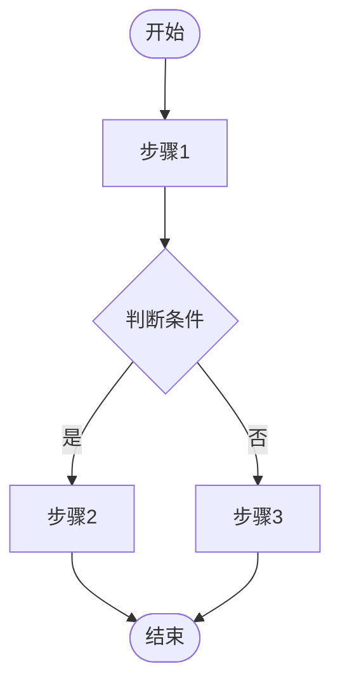
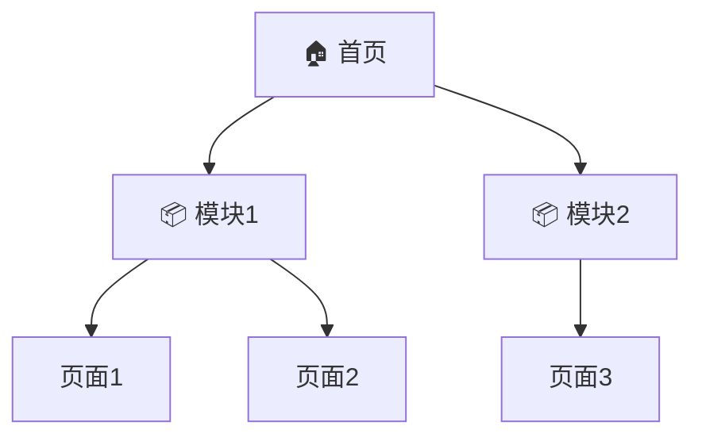

# PRD Designer

将模糊的需求想法转化为结构化的 PRD 文档，支持多种输入形式，输出包含 Mermaid 图和结构化元数据的完整 PRD。

## 支持的输入形式

| 输入形式 | 示例 |
|----------|------|
| 口头/聊天式描述 | "我想做一个记账 App" |
| 功能列表 | "需要登录、记账、统计报表" |
| 竞品参考 | "我想做一个类似 Notion 的产品" |
| 会议纪要 | 粘贴会议记录文本 |
| 混合形式 | 以上任意组合 |

## 工作流程

### 阶段 1：产品愿景

1. 了解产品要解决什么问题
2. 明确目标用户群体
3. 确定核心价值主张

**关键问题：**
- 这个产品解决什么痛点？
- 目标用户是谁？
- 与竞品相比的差异化是什么？

### 阶段 2：核心场景

1. 识别用户的主要使用场景
2. 梳理关键用户旅程
3. 确定核心用例

**关键问题：**
- 用户在什么情况下会使用这个产品？
- 用户的典型使用流程是什么？
- 最重要的 3-5 个场景是哪些？

### 阶段 3：功能梳理

1. 列出所有需要的功能
2. 按模块分组组织
3. 为每个功能编写简要描述

**关键问题：**
- 需要哪些具体功能？
- 功能如何分模块组织？
- 每个功能的核心作用是什么？

### 阶段 4：边界确认

1. 明确产品的边界
2. 列出不做的功能/场景
3. 说明排除的原因

**关键问题：**
- 哪些功能明确不做？
- 哪些场景不在支持范围内？
- 为什么要排除这些？

### 阶段 5：优先级排序

1. 使用 MoSCoW 方法排序
2. 确定 MVP 范围
3. 规划后续迭代

**优先级定义：**

| 优先级 | 含义 | 说明 |
|--------|------|------|
| P0 | Must Have | MVP 必须包含 |
| P1 | Should Have | 重要但非必须 |
| P2 | Could Have | 锦上添花 |
| P3 | Won't Have | 本期不做 |

### 阶段 6：非功能需求

1. 性能要求（响应时间、并发量等）
2. 安全要求（认证、加密等）
3. 兼容性要求（平台、浏览器等）
4. 其他约束

**关键问题：**
- 有性能指标要求吗？
- 有安全合规要求吗？
- 需要支持哪些平台/设备？

### 阶段 7：生成文档

1. 汇总所有信息
2. 生成 Mermaid 图（用户流程图、信息架构图）
3. 生成结构化元数据
4. 输出完整 PRD 文档

## 输出文档结构

```markdown
# [产品名称] PRD

## 1. 产品概述

### 1.1 产品愿景
[一句话描述产品定位]

### 1.2 目标用户
[用户画像描述]

### 1.3 核心价值
[产品提供的核心价值]

## 2. 用户故事

### 2.1 [角色名称]
- 作为[角色]，我想要[功能]，以便[价值]
- ...

## 3. 功能需求

### 3.1 [模块名称]

#### 3.1.1 [功能名称]
- **优先级**: P0
- **描述**: [功能描述]
- **验收标准**: 
  - [ ] [标准1]
  - [ ] [标准2]

### 3.2 用户流程图

​```mermaid
flowchart TD
    A[开始] --> B[步骤1]
    B --> C{判断}
    C -->|是| D[步骤2]
    C -->|否| E[步骤3]
    D --> F[结束]
    E --> F
​```

## 4. 不做什么（Out of Scope）

| 功能/场景 | 排除原因 |
|-----------|----------|
| [功能1] | [原因] |
| [功能2] | [原因] |

## 5. 非功能需求

### 5.1 性能要求
- [要求1]

### 5.2 安全要求
- [要求1]

### 5.3 兼容性要求
- [要求1]

## 6. 信息架构

​```mermaid
graph TD
    A[首页] --> B[模块1]
    A --> C[模块2]
    B --> D[子页面1]
    B --> E[子页面2]
    C --> F[子页面3]
​```

## 7. 约束与假设

### 7.1 约束条件
- [约束1]

### 7.2 假设前提
- [假设1]

## 8. 附录

### 8.1 竞品参考
[如有]

### 8.2 术语表
| 术语 | 定义 |
|------|------|
| [术语1] | [定义] |

---

## META（供其他 Skill 解析）

​```yaml
product:
  name: [产品名称]
  version: "1.0"
  
modules:
  - name: [模块名称]
    priority: P0
    features:
      - name: [功能名称]
        priority: P0
        description: [描述]
      - name: [功能名称]
        priority: P1
        description: [描述]
        
  - name: [模块名称]
    priority: P1
    features:
      - name: [功能名称]
        priority: P1
        description: [描述]

out_of_scope:
  - [不做的功能1]
  - [不做的功能2]

non_functional:
  performance:
    - [性能要求]
  security:
    - [安全要求]
  compatibility:
    - [兼容性要求]
​```
```

## 详细程度调整

根据项目复杂度自动调整 PRD 详细程度：

| 复杂度 | 判断标准 | 文档篇幅 | 章节详细度 |
|--------|----------|----------|------------|
| 简单 | ≤3 个模块，≤10 个功能 | 2-3 页 | 简化版 |
| 中等 | 4-6 个模块，11-25 个功能 | 4-6 页 | 标准版 |
| 复杂 | >6 个模块，>25 个功能 | 7+ 页 | 完整版 |

**简化版调整：**
- 用户故事可合并
- 验收标准可简化
- 信息架构图可选

**完整版增强：**
- 每个功能详细验收标准
- 完整的用户旅程图
- 详细的数据流图

## 竞品分析（可选）

如果用户提供竞品参考，执行以下分析：

1. **功能对比**：列出竞品核心功能
2. **差异化分析**：找出差异化机会
3. **借鉴建议**：可借鉴的优点

输出格式：

```markdown
### 竞品分析：[竞品名称]

**核心功能：**
- [功能1]
- [功能2]

**我们的差异化：**
- [差异点1]
- [差异点2]

**可借鉴：**
- [借鉴点1]
```

## Mermaid 图规范

### 用户流程图

用于展示用户完成核心任务的步骤：



### 信息架构图

用于展示产品的页面/模块结构：



## 与其他 Skill 的衔接

PRD Designer 输出的文档可作为以下 Skill 的输入：

| 下游 Skill | 使用的数据 |
|------------|------------|
| spec-designer | META.modules, META.non_functional |
| ui-designer | META.modules, 信息架构图 |
| task-planner | META.modules, 功能需求章节 |

META 数据格式约定确保 Skill 间的无缝衔接。

## 注意事项

1. **渐进式澄清** — 每个阶段确认后再进入下一阶段
2. **边界先行** — 尽早明确"不做什么"，避免范围蔓延
3. **优先级务实** — P0 功能控制在合理范围，确保 MVP 可行
4. **图文结合** — 复杂流程用 Mermaid 图表达，提高可读性
5. **元数据完整** — 确保 META 部分数据完整，方便下游 Skill 解析
