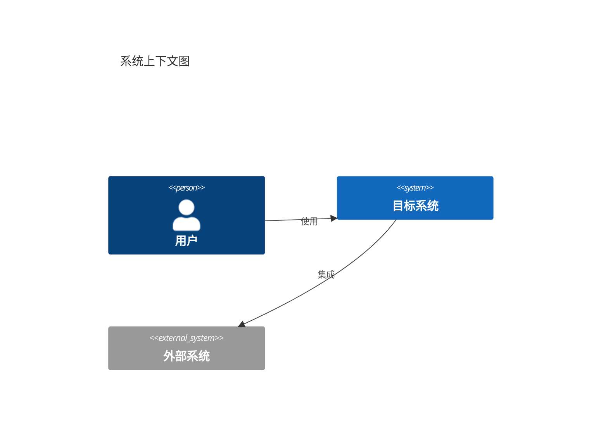
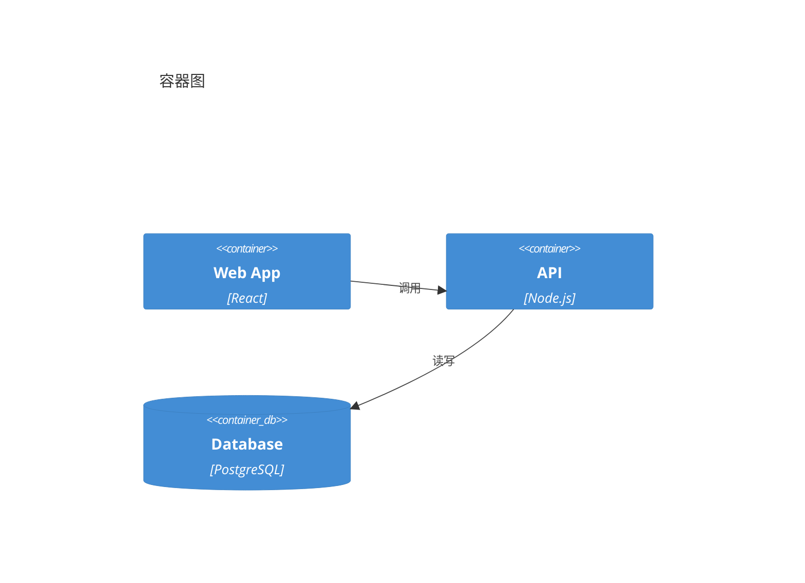
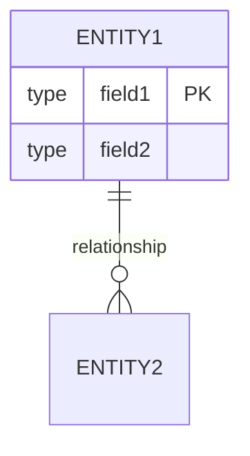

# Spec Designer

将 PRD 转化为结构化的技术规格文档，通过与架构师/工程师的协作讨论，融入专家经验，输出清晰无歧义、可供 AI Agent 直接执行的 Tech Spec。

## 设计原则

1. **AI 可执行** — 结构化、无歧义，Agent 可直接理解和执行
2. **专家协作** — 引导式讨论，融入架构师/工程师的专业经验
3. **决策记录** — 记录技术选型原因，便于后续理解和维护

## 输入要求

### 必需输入
- **PRD 文档** — 包含 META 数据的产品需求文档

### 可选输入
- **团队规范配置** — `.team-standards.yaml` 文件
- **参考架构** — 已有项目或架构模板

## 团队规范配置

支持读取项目根目录下的 `.team-standards.yaml`：

```yaml
# .team-standards.yaml 示例
tech_stack:
  frontend: React + TypeScript + TailwindCSS
  backend: Node.js + Express + TypeScript
  database: PostgreSQL
  cache: Redis
  
code_style:
  naming_convention: camelCase
  indent: 2 spaces
  max_line_length: 100
  quote_style: single
  
architecture:
  pattern: Clean Architecture
  api_style: RESTful
  auth_method: JWT
  
conventions:
  file_naming: kebab-case
  component_naming: PascalCase
  test_framework: Jest
```

如存在此文件，Skill 会自动读取并应用，讨论时向用户确认。

## 工作流程

### 阶段 1：读取 PRD

1. 读取 PRD 文档，解析 META 数据
2. 理解产品功能模块和优先级
3. 识别技术挑战点

**输出：** PRD 要点总结，确认理解正确

### 阶段 2：技术栈选型

与用户讨论确定技术方案：

| 层级 | 讨论点 | 常见选项 |
|------|--------|----------|
| 前端 | 框架、UI 库、状态管理 | React/Vue/Next.js |
| 后端 | 语言、框架、ORM | Node.js/Python/Go |
| 数据库 | 类型、具体产品 | PostgreSQL/MySQL/MongoDB |
| 缓存 | 是否需要、产品选择 | Redis/Memcached |
| 部署 | 容器化、云平台 | Docker/K8s/Vercel |

**关键问题：**
- 团队熟悉什么技术栈？
- 有没有技术限制或偏好？
- 是否需要考虑现有系统集成？

**输出：** 技术栈选型表 + 选型理由

### 阶段 3：架构设计

设计整体系统架构，使用 C4 模型：

**C4 模型层级：**

```
Level 1: System Context（系统上下文）
    └── Level 2: Container（容器）
            └── Level 3: Component（组件）
                    └── Level 4: Code（代码）
```

**讨论点：**
- 系统边界和外部依赖
- 服务划分（单体/微服务）
- 通信方式（同步/异步）
- 数据流向

**输出：** C4 架构图（Mermaid）

### 阶段 4：数据模型设计

设计数据库结构：

**讨论点：**
- 核心实体识别
- 实体间关系（1:1, 1:N, N:M）
- 索引策略
- 数据类型选择

**输出：** ER 图 + 表结构定义（SQL/Prisma）

### 阶段 5：API 设计

定义接口规范：

**讨论点：**
- API 风格（RESTful/GraphQL）
- 认证方式（JWT/OAuth/API Key）
- 版本策略
- 错误处理规范

**输出：** API 清单 + 请求/响应格式

### 阶段 6：项目结构设计

规划目录组织：

**讨论点：**
- 目录分层策略
- 模块划分方式
- 文件命名规范
- 公共代码组织

**输出：** 目录结构树

### 阶段 7：代码规范确认

确定编码标准：

**讨论点：**
- 命名约定（变量、函数、类、文件）
- 格式化规则（缩进、引号、分号）
- Lint 配置
- 注释规范

**输出：** 代码规范清单

### 阶段 8：生成文档

汇总所有讨论结果，生成完整 Tech Spec。

## 输出文档结构

```markdown
# [项目名称] 技术规格文档

## 1. 技术栈选型

| 层级 | 技术 | 版本 | 选型理由 |
|------|------|------|----------|
| 前端 | React + TypeScript | 18.x | ... |
| 后端 | Node.js + Express | 20.x | ... |
| 数据库 | PostgreSQL | 15.x | ... |

## 2. 系统架构

### 2.1 系统上下文图（C4 Level 1）

​```mermaid
C4Context
    title 系统上下文图
    
    Person(user, "用户", "使用系统的终端用户")
    System(system, "系统名称", "系统描述")
    System_Ext(external, "外部系统", "外部依赖")
    
    Rel(user, system, "使用")
    Rel(system, external, "调用")
​```

### 2.2 容器图（C4 Level 2）

​```mermaid
C4Container
    title 容器图
    
    Person(user, "用户")
    
    Container_Boundary(system, "系统边界") {
        Container(web, "Web 应用", "React", "用户界面")
        Container(api, "API 服务", "Node.js", "业务逻辑")
        ContainerDb(db, "数据库", "PostgreSQL", "数据存储")
        Container(cache, "缓存", "Redis", "会话/缓存")
    }
    
    Rel(user, web, "访问", "HTTPS")
    Rel(web, api, "调用", "REST API")
    Rel(api, db, "读写")
    Rel(api, cache, "读写")
​```

### 2.3 组件图（C4 Level 3）

​```mermaid
C4Component
    title API 服务组件图
    
    Container_Boundary(api, "API 服务") {
        Component(auth, "认证模块", "处理用户认证")
        Component(user, "用户模块", "用户管理")
        Component(task, "任务模块", "任务管理")
    }
    
    Rel(auth, user, "验证用户")
    Rel(task, user, "获取用户信息")
​```

### 2.4 数据流图

​```mermaid
flowchart LR
    User[用户] --> Frontend[前端]
    Frontend --> API[API 服务]
    API --> DB[(数据库)]
    API --> Cache[(缓存)]
    API --> External[外部服务]
​```

## 3. 数据模型

### 3.1 ER 图

​```mermaid
erDiagram
    users ||--o{ tasks : creates
    users ||--o{ team_members : joins
    teams ||--o{ team_members : has
    teams ||--o{ tasks : contains
    
    users {
        uuid id PK
        string email UK
        string password_hash
        string name
        timestamp created_at
    }
    
    tasks {
        uuid id PK
        string title
        text description
        enum status
        uuid creator_id FK
        uuid team_id FK
    }
​```

### 3.2 表结构定义

​```sql
-- users 表
CREATE TABLE users (
    id UUID PRIMARY KEY DEFAULT gen_random_uuid(),
    email VARCHAR(255) UNIQUE NOT NULL,
    password_hash VARCHAR(255) NOT NULL,
    name VARCHAR(100) NOT NULL,
    created_at TIMESTAMP DEFAULT NOW()
);

-- 索引
CREATE INDEX idx_users_email ON users(email);
​```

### 3.3 Prisma Schema（可选）

​```prisma
model User {
  id           String   @id @default(uuid())
  email        String   @unique
  passwordHash String   @map("password_hash")
  name         String
  createdAt    DateTime @default(now()) @map("created_at")
  
  @@map("users")
}
​```

## 4. API 设计

### 4.1 认证方式

- **类型**: JWT Bearer Token
- **有效期**: 7 天
- **刷新机制**: [描述]

### 4.2 API 清单

| 方法 | 路径 | 模块 | 描述 | 认证 |
|------|------|------|------|------|
| POST | /api/auth/register | auth | 用户注册 | 否 |
| POST | /api/auth/login | auth | 用户登录 | 否 |
| GET | /api/users/:id | user | 获取用户 | 是 |

### 4.3 请求/响应格式

**成功响应：**
​```json
{
  "success": true,
  "data": { ... }
}
​```

**错误响应：**
​```json
{
  "success": false,
  "error": {
    "code": "ERROR_CODE",
    "message": "错误描述"
  }
}
​```

## 5. 项目结构

### 5.1 后端结构

​```
backend/
├── src/
│   ├── controllers/     # 控制器
│   ├── services/        # 业务逻辑
│   ├── models/          # 数据模型
│   ├── routes/          # 路由定义
│   ├── middleware/      # 中间件
│   ├── utils/           # 工具函数
│   └── app.ts           # 入口文件
├── prisma/
│   └── schema.prisma    # 数据库 Schema
├── tests/               # 测试文件
└── package.json
​```

### 5.2 前端结构

​```
frontend/
├── src/
│   ├── components/      # 通用组件
│   │   └── ui/          # UI 基础组件
│   ├── pages/           # 页面组件
│   ├── hooks/           # 自定义 Hooks
│   ├── services/        # API 服务
│   ├── store/           # 状态管理
│   ├── types/           # 类型定义
│   └── App.tsx          # 入口组件
└── package.json
​```

## 6. 依赖清单

### 6.1 后端依赖

​```json
{
  "dependencies": {
    "express": "^4.18.0",
    "@prisma/client": "^5.0.0",
    "jsonwebtoken": "^9.0.0",
    "bcryptjs": "^2.4.3"
  },
  "devDependencies": {
    "typescript": "^5.0.0",
    "prisma": "^5.0.0",
    "@types/node": "^20.0.0"
  }
}
​```

### 6.2 前端依赖

​```json
{
  "dependencies": {
    "react": "^18.2.0",
    "react-router-dom": "^6.0.0"
  },
  "devDependencies": {
    "typescript": "^5.0.0",
    "vite": "^5.0.0",
    "tailwindcss": "^3.0.0"
  }
}
​```

## 7. 环境配置

### 7.1 必需环境变量

| 变量名 | 描述 | 示例 |
|--------|------|------|
| DATABASE_URL | 数据库连接 | postgresql://... |
| JWT_SECRET | JWT 密钥 | your-secret-key |
| REDIS_URL | Redis 连接 | redis://localhost:6379 |

### 7.2 可选环境变量

| 变量名 | 描述 | 默认值 |
|--------|------|--------|
| PORT | 服务端口 | 3000 |
| NODE_ENV | 运行环境 | development |

### 7.3 基础设施要求

| 组件 | 最低要求 | 推荐配置 |
|------|----------|----------|
| Node.js | >= 18.0.0 | 20.x LTS |
| PostgreSQL | >= 14 | 15.x |
| 内存 | 512MB | 1GB |
| CPU | 1 核 | 2 核 |

## 8. 代码规范

### 8.1 命名约定

| 类型 | 规范 | 示例 |
|------|------|------|
| 变量/函数 | camelCase | getUserById |
| 类/组件 | PascalCase | UserService |
| 常量 | UPPER_SNAKE | MAX_RETRY |
| 文件（组件） | PascalCase | UserCard.tsx |
| 文件（其他） | kebab-case | auth-utils.ts |

### 8.2 格式化规则

​```json
{
  "semi": true,
  "singleQuote": true,
  "tabWidth": 2,
  "printWidth": 100,
  "trailingComma": "es5"
}
​```

### 8.3 Lint 规则

- 使用 ESLint + @typescript-eslint
- 禁止 any 类型
- 要求显式返回类型

## 9. 技术约束

### 9.1 安全要求

- 密码使用 bcrypt 加密（10 轮）
- API 使用 HTTPS
- 敏感数据不记录日志

### 9.2 性能要求

- API 响应时间 < 200ms（P95）
- 支持 100 并发用户

### 9.3 兼容性要求

- 浏览器：Chrome/Firefox/Safari 最新 2 个版本
- 移动端：响应式设计

---

## META（供其他 Skill 解析）

​```yaml
project:
  name: [项目名称]
  version: "1.0"

tech_stack:
  frontend:
    framework: React
    language: TypeScript
    ui: TailwindCSS
    state: Context API
  backend:
    runtime: Node.js
    framework: Express
    language: TypeScript
    orm: Prisma
  database:
    type: PostgreSQL
    version: "15"
  cache:
    type: Redis
    version: "7"

architecture:
  pattern: MVC
  api_style: RESTful
  auth_method: JWT
  layers:
    - controller
    - service
    - model
    - route

modules:
  - name: auth
    type: backend
    priority: P0
    dependencies: []
    files:
      - src/controllers/auth.ts
      - src/routes/auth.ts
      - src/middleware/auth.ts
    endpoints:
      - method: POST
        path: /api/auth/register
      - method: POST
        path: /api/auth/login

  - name: user
    type: backend
    priority: P1
    dependencies: [auth]
    files:
      - src/controllers/user.ts
      - src/routes/user.ts
    endpoints:
      - method: GET
        path: /api/users/:id
      - method: PUT
        path: /api/users/:id

database_tables:
  - name: users
    primary_key: id
    fields:
      - name: id
        type: UUID
        constraints: [PK]
      - name: email
        type: VARCHAR(255)
        constraints: [UNIQUE, NOT NULL]
      - name: password_hash
        type: VARCHAR(255)
        constraints: [NOT NULL]
    indexes:
      - name: idx_users_email
        fields: [email]

environment:
  node_version: ">=18.0.0"
  required_env_vars:
    - name: DATABASE_URL
      description: PostgreSQL 连接字符串
    - name: JWT_SECRET
      description: JWT 签名密钥
  optional_env_vars:
    - name: PORT
      description: 服务端口
      default: "3000"

dependencies:
  backend:
    runtime:
      express: "^4.18.0"
      "@prisma/client": "^5.0.0"
      jsonwebtoken: "^9.0.0"
    dev:
      typescript: "^5.0.0"
      prisma: "^5.0.0"
  frontend:
    runtime:
      react: "^18.2.0"
      react-router-dom: "^6.0.0"
    dev:
      typescript: "^5.0.0"
      vite: "^5.0.0"

infrastructure:
  min_requirements:
    memory: 512MB
    cpu: 1 core
    node: "18.0.0"
  recommended:
    memory: 1GB
    cpu: 2 cores
    node: "20.x"

code_style:
  naming:
    variables: camelCase
    functions: camelCase
    classes: PascalCase
    constants: UPPER_SNAKE
    files_component: PascalCase
    files_other: kebab-case
  formatting:
    indent: 2
    quotes: single
    semicolons: true
    max_line_length: 100
​```
```

## Mermaid 图规范

### C4 系统上下文图



### C4 容器图



### ER 图



## 与其他 Skill 的衔接

| 上游 Skill | 输入数据 |
|------------|----------|
| prd-designer | PRD.META.modules, PRD.META.out_of_scope |

| 下游 Skill | 输出数据 |
|------------|----------|
| task-planner | META.modules, META.database_tables, META.endpoints |
| ui-designer | META.modules, 项目结构 |

## 注意事项

1. **充分讨论** — 每个阶段与用户充分确认，避免后期返工
2. **记录决策** — 技术选型要记录原因，便于后续理解
3. **保持一致** — 命名、格式等规范贯穿全文档
4. **可执行性** — 确保 Agent 能直接基于文档执行任务
5. **META 完整** — 确保下游 Skill 所需数据完整
