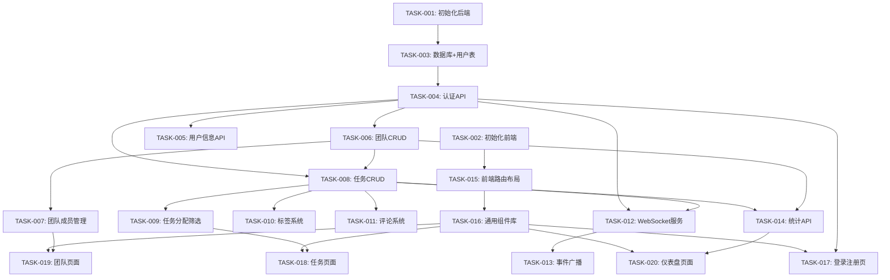

# TaskFlow 开发任务计划

## 元信息
- **PRD**: test/PRD.md
- **Spec**: test/Spec.md
- **生成时间**: 2026-01-29 15:30
- **任务总数**: 20

## 任务依赖图

### Mermaid 视图

### 依赖列表
- TASK-001: 无依赖
- TASK-002: 无依赖
- TASK-003: 依赖 [TASK-001]
- TASK-004: 依赖 [TASK-003]
- TASK-005: 依赖 [TASK-004]
- TASK-006: 依赖 [TASK-004]
- TASK-007: 依赖 [TASK-006]
- TASK-008: 依赖 [TASK-004, TASK-006]
- TASK-009: 依赖 [TASK-008]
- TASK-010: 依赖 [TASK-008]
- TASK-011: 依赖 [TASK-008]
- TASK-012: 依赖 [TASK-004, TASK-008]
- TASK-013: 依赖 [TASK-012]
- TASK-014: 依赖 [TASK-008, TASK-006]
- TASK-015: 依赖 [TASK-002]
- TASK-016: 依赖 [TASK-015]
- TASK-017: 依赖 [TASK-016, TASK-004]
- TASK-018: 依赖 [TASK-016, TASK-009]
- TASK-019: 依赖 [TASK-016, TASK-007]
- TASK-020: 依赖 [TASK-016, TASK-014]

## 任务列表

### TASK-001: 初始化后端项目
- **状态**: completed
- **执行者**: session-20260129-153500-a1b
- **认领时间**: 2026-01-29 15:35:00
- **优先级**: P0
- **依赖**: 无
- **模块**: 基础设施
- **描述**: 初始化 Node.js + Express + TypeScript 后端项目，配置 ESLint、Prettier、目录结构
- **验收标准**: 项目可运行 `npm run dev`，返回健康检查接口
- **相关文件**: backend/

### TASK-002: 初始化前端项目
- **状态**: completed
- **执行者**: session-20260129-153500-c2d
- **认领时间**: 2026-01-29 15:35:00
- **优先级**: P0
- **依赖**: 无
- **模块**: 基础设施
- **描述**: 初始化 React + TypeScript + TailwindCSS 前端项目，配置 Vite、目录结构
- **验收标准**: 项目可运行 `npm run dev`，显示欢迎页面
- **相关文件**: frontend/

### TASK-003: 数据库配置 + 用户表设计
- **状态**: completed
- **执行者**: session-20260129-154000-e3f
- **认领时间**: 2026-01-29 15:40:00
- **优先级**: P0
- **依赖**: [TASK-001]
- **模块**: 用户认证
- **描述**: 配置 PostgreSQL + Prisma ORM，创建 users 表，编写迁移脚本
- **验收标准**: 数据库可连接，用户表已创建，Prisma Client 可用
- **相关文件**: backend/prisma/, backend/src/models/

### TASK-004: 实现认证 API
- **状态**: completed
- **执行者**: session-20260129-154500-i5j
- **认领时间**: 2026-01-29 15:45:00
- **优先级**: P0
- **依赖**: [TASK-003]
- **模块**: 用户认证
- **描述**: 实现注册、登录、登出、获取当前用户 API，JWT Token 生成与验证中间件
- **验收标准**: 所有认证接口可用，Token 验证正确
- **相关文件**: backend/src/controllers/auth.ts, backend/src/middleware/auth.ts

### TASK-005: 实现用户信息 API
- **状态**: completed
- **执行者**: session-20260129-155000-m7n
- **认领时间**: 2026-01-29 15:50:00
- **优先级**: P2
- **依赖**: [TASK-004]
- **模块**: 用户管理
- **描述**: 实现获取用户信息、更新用户信息 API
- **验收标准**: 用户可查看和编辑个人资料
- **相关文件**: backend/src/controllers/user.ts

### TASK-006: 团队 CRUD API
- **状态**: completed
- **执行者**: session-20260129-155000-o8p
- **认领时间**: 2026-01-29 15:50:00
- **优先级**: P1
- **依赖**: [TASK-004]
- **模块**: 团队管理
- **描述**: 创建 teams/team_members 表，实现团队创建、查询、更新、删除 API
- **验收标准**: 团队 CRUD 接口全部可用
- **相关文件**: backend/src/controllers/team.ts, backend/prisma/

### TASK-007: 团队成员管理
- **状态**: completed
- **执行者**: session-20260129-155500-s1t
- **认领时间**: 2026-01-29 15:55:00
- **优先级**: P2
- **依赖**: [TASK-006]
- **模块**: 团队管理
- **描述**: 实现邀请成员、加入团队、离开团队、成员角色管理 API
- **验收标准**: 团队成员管理功能完整
- **相关文件**: backend/src/controllers/team.ts

### TASK-008: 任务表设计 + CRUD API
- **状态**: completed
- **执行者**: session-20260129-155500-u2v
- **认领时间**: 2026-01-29 15:55:00
- **优先级**: P0
- **依赖**: [TASK-004, TASK-006]
- **模块**: 任务核心
- **描述**: 创建 tasks 表，实现任务创建、查询、更新、删除 API
- **验收标准**: 任务 CRUD 接口全部可用
- **相关文件**: backend/src/controllers/task.ts, backend/prisma/

### TASK-009: 任务分配、状态流转、筛选查询
- **状态**: completed
- **执行者**: session-20260129-160000-w3x
- **认领时间**: 2026-01-29 16:00:00
- **优先级**: P1
- **依赖**: [TASK-008]
- **模块**: 任务核心
- **描述**: 实现任务分配给成员、状态流转（pending→in_progress→completed）、按状态/优先级/成员筛选
- **验收标准**: 任务分配和筛选功能完整
- **相关文件**: backend/src/controllers/task.ts

### TASK-010: 标签系统
- **状态**: completed
- **执行者**: session-20260129-160000-y4z
- **认领时间**: 2026-01-29 16:00:00
- **优先级**: P2
- **依赖**: [TASK-008]
- **模块**: 任务标签
- **描述**: 创建 tags/task_tags 表，实现标签 CRUD、任务打标/移除标签 API
- **验收标准**: 标签系统功能完整
- **相关文件**: backend/src/controllers/tag.ts, backend/prisma/

### TASK-011: 评论系统
- **状态**: completed
- **执行者**: session-20260129-160000-a5b
- **认领时间**: 2026-01-29 16:00:00
- **优先级**: P2
- **依赖**: [TASK-008]
- **模块**: 任务评论
- **描述**: 创建 comments 表，实现评论添加、查询、删除 API，支持 @成员提及
- **验收标准**: 评论系统功能完整，@提及可解析
- **相关文件**: backend/src/controllers/comment.ts, backend/prisma/

### TASK-012: WebSocket 服务端
- **状态**: completed
- **执行者**: session-20260129-160500-e7f
- **认领时间**: 2026-01-29 16:05:00
- **优先级**: P3
- **依赖**: [TASK-004, TASK-008]
- **模块**: 实时同步
- **描述**: 集成 Socket.io，实现 WebSocket 连接、JWT 认证、房间管理（按团队）
- **验收标准**: WebSocket 可连接，认证通过后加入团队房间
- **相关文件**: backend/src/services/socket.ts

### TASK-013: 事件广播
- **状态**: completed
- **执行者**: session-20260129-161000-k1l
- **认领时间**: 2026-01-29 16:10:00
- **优先级**: P3
- **依赖**: [TASK-012]
- **模块**: 实时同步
- **描述**: 实现任务变更、评论添加、用户上下线事件广播
- **验收标准**: 变更实时推送到团队成员
- **相关文件**: backend/src/services/socket.ts

### TASK-014: 统计 API
- **状态**: completed
- **执行者**: session-20260129-160500-g8h
- **认领时间**: 2026-01-29 16:05:00
- **优先级**: P3
- **依赖**: [TASK-008, TASK-006]
- **模块**: 数据看板
- **描述**: 实现任务统计（按状态/时间）、团队成员工作量统计 API
- **验收标准**: 统计接口返回正确数据
- **相关文件**: backend/src/controllers/stats.ts

### TASK-015: 前端路由 + 布局组件
- **状态**: completed
- **执行者**: session-20260129-154000-g4h
- **认领时间**: 2026-01-29 15:40:00
- **优先级**: P0
- **依赖**: [TASK-002]
- **模块**: 前端基础
- **描述**: 配置 React Router，实现主布局（侧边栏 + 顶栏 + 内容区）、认证路由守卫
- **验收标准**: 路由切换正常，布局响应式
- **相关文件**: frontend/src/App.tsx, frontend/src/components/Layout/

### TASK-016: 通用组件库
- **状态**: completed
- **执行者**: session-20260129-154500-k6l
- **认领时间**: 2026-01-29 15:45:00
- **优先级**: P1
- **依赖**: [TASK-015]
- **模块**: 前端基础
- **描述**: 实现 Button、Input、Modal、Select、Avatar、Badge 等通用组件
- **验收标准**: 组件风格统一，支持常用 props
- **相关文件**: frontend/src/components/ui/

### TASK-017: 登录/注册页面
- **状态**: completed
- **执行者**: session-20260129-155000-q9r
- **认领时间**: 2026-01-29 15:50:00
- **优先级**: P1
- **依赖**: [TASK-016, TASK-004]
- **模块**: 前端页面
- **描述**: 实现登录、注册页面，对接认证 API，Token 存储
- **验收标准**: 用户可正常登录注册，登录后跳转首页
- **相关文件**: frontend/src/pages/Login.tsx, frontend/src/pages/Register.tsx

### TASK-018: 任务列表/详情页面
- **状态**: completed
- **执行者**: session-20260129-160500-i9j
- **认领时间**: 2026-01-29 16:05:00
- **优先级**: P1
- **依赖**: [TASK-016, TASK-009]
- **模块**: 前端页面
- **描述**: 实现任务列表（筛选、排序）、任务详情（编辑、状态、评论）页面
- **验收标准**: 任务管理核心功能可用
- **相关文件**: frontend/src/pages/Tasks.tsx, frontend/src/pages/TaskDetail.tsx

### TASK-019: 团队管理页面
- **状态**: completed
- **执行者**: session-20260129-160000-c6d
- **认领时间**: 2026-01-29 16:00:00
- **优先级**: P2
- **依赖**: [TASK-016, TASK-007]
- **模块**: 前端页面
- **描述**: 实现团队列表、团队详情、成员管理、邀请成员页面
- **验收标准**: 团队管理功能可用
- **相关文件**: frontend/src/pages/Teams.tsx, frontend/src/pages/TeamDetail.tsx

### TASK-020: 仪表盘/看板页面
- **状态**: completed
- **执行者**: session-20260129-161000-m2n
- **认领时间**: 2026-01-29 16:10:00
- **优先级**: P3
- **依赖**: [TASK-016, TASK-014]
- **模块**: 前端页面
- **描述**: 实现仪表盘页面，展示任务统计图表、团队工作量、待办概览
- **验收标准**: 统计数据正确展示，图表可交互
- **相关文件**: frontend/src/pages/Dashboard.tsx
