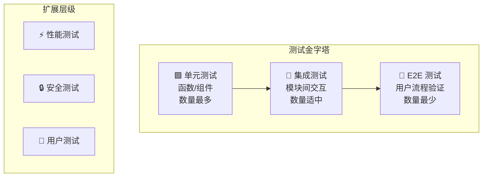
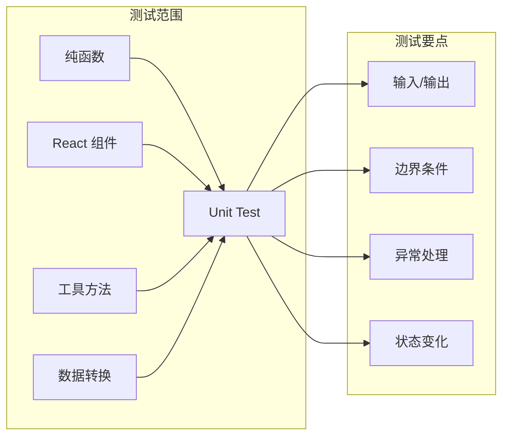
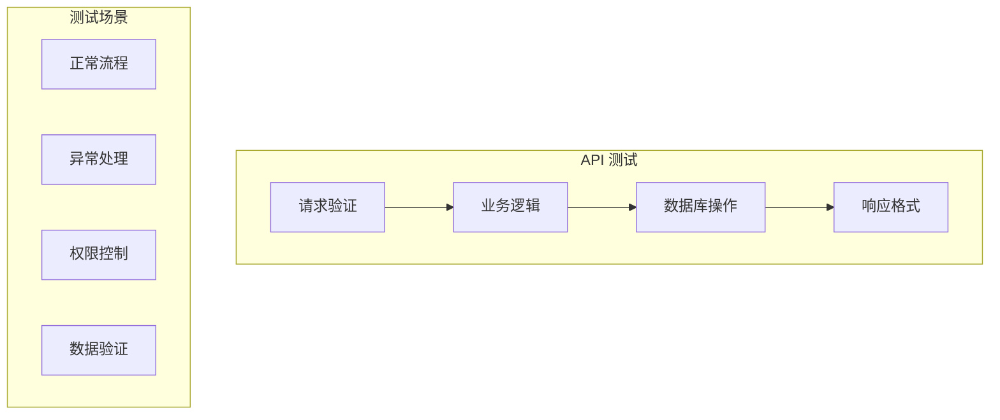
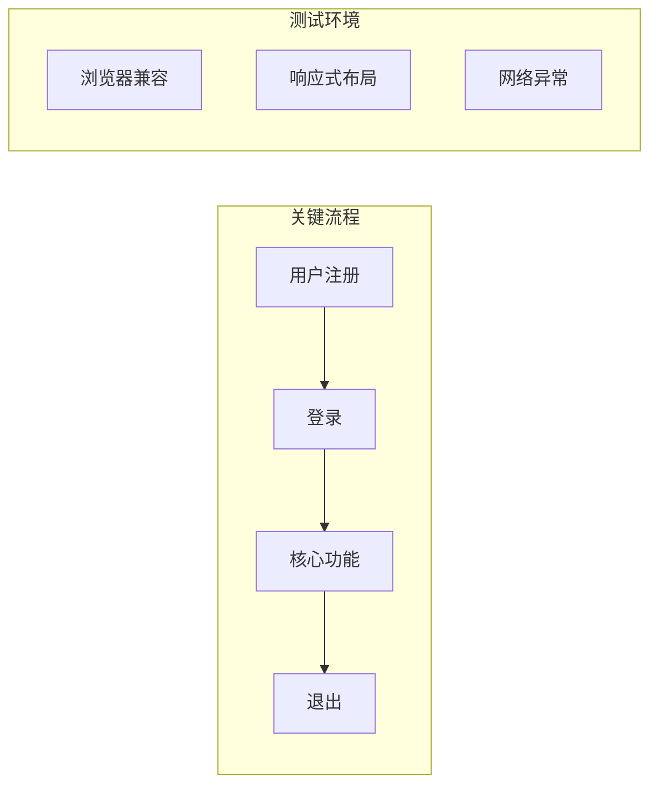

# Test Planner

将 PRD 和 Spec 转化为完整的测试计划，覆盖自动化测试和用户测试，确保产品质量。

## 设计原则

1. **自动化优先** — 尽可能覆盖自动化测试，减少人工回归成本
2. **分层测试** — 按测试金字塔分层：Unit → Integration → E2E
3. **可执行** — 输出内容可直接指导测试实施
4. **灵活深度** — 根据项目复杂度动态调整测试范围

## 输入要求

### 必需输入
- **PRD 文档** — 功能需求和用户场景
- **Spec 文档** — 技术架构和 API 设计

### 可选输入
- **TASKS.md** — 开发任务列表（用于追踪测试覆盖）
- **现有测试配置** — 项目已有的测试框架配置

## 测试层级定义



| 层级 | 覆盖范围 | 执行频率 | 工具类型 |
|------|----------|----------|----------|
| Unit | 函数、组件、工具方法 | 每次提交 | Jest, pytest, go test |
| Integration | API、数据库、服务间调用 | 每次 PR | Supertest, httpx, testify |
| E2E | 完整用户流程 | 每日/发布前 | Playwright, Cypress |
| Performance | 负载、响应时间 | 发布前 | k6, locust, Artillery |
| Security | 漏洞、权限、注入 | 发布前 | OWASP ZAP, npm audit |
| User Test | 可用性、UAT | 发布前 | 手动执行 |

## 工作流程

### 阶段 1：读取输入文档

1. 读取 PRD，提取功能模块和用户场景
2. 读取 Spec，提取技术栈、API、数据模型
3. （可选）读取 TASKS.md，了解开发任务划分

**输出：** 文档理解摘要

### 阶段 2：确定测试范围

与用户讨论确定测试层级：

```
Q: 这个项目需要覆盖哪些测试层级？

建议的测试范围（基于项目复杂度分析）：

| 层级 | 建议 | 原因 |
|------|------|------|
| Unit | ✅ 必需 | 核心业务逻辑需要保障 |
| Integration | ✅ 必需 | 有 X 个 API 端点需要测试 |
| E2E | ✅ 建议 | 有 Y 个关键用户流程 |
| Performance | ⚠️ 可选 | 预期用户量决定 |
| Security | ⚠️ 可选 | 涉及用户数据需考虑 |

请确认或调整：[A] 接受建议 [B] 自定义选择
```

**输出：** 确认的测试层级范围

### 阶段 3：推荐测试工具

根据 Spec 中的技术栈自动推荐：

#### 前端测试工具矩阵

| 技术栈 | Unit | Integration | E2E |
|--------|------|-------------|-----|
| React + TypeScript | Jest + RTL | MSW | Playwright |
| Vue + TypeScript | Vitest + VTL | MSW | Playwright |
| Next.js | Jest + RTL | MSW | Playwright |
| 原生 JS | Jest | - | Playwright |

#### 后端测试工具矩阵

| 技术栈 | Unit | Integration | E2E |
|--------|------|-------------|-----|
| Node.js + Express | Jest | Supertest | Playwright |
| Node.js + Fastify | Jest/Vitest | light-my-request | Playwright |
| Python + FastAPI | pytest | httpx + TestClient | Playwright |
| Python + Django | pytest-django | Django TestCase | Playwright |
| Go + Gin | testing | httptest | Playwright |
| Java + Spring | JUnit | MockMvc | Playwright |

#### 扩展测试工具

| 类型 | 推荐工具 |
|------|----------|
| Performance | k6, Artillery, locust |
| Security | npm audit, OWASP ZAP, Snyk |
| Coverage | c8, nyc, coverage.py, go cover |

**询问用户确认：**

```
基于您的技术栈 [Node.js + Express + React]，推荐以下测试工具：

| 层级 | 工具 | 说明 |
|------|------|------|
| 前端 Unit | Jest + React Testing Library | React 官方推荐 |
| 后端 Unit | Jest | 与前端统一 |
| API Integration | Supertest | Express 生态主流 |
| E2E | Playwright | 跨浏览器，稳定性好 |

请确认或调整：[A] 接受 [B] 更换某项工具
```

**输出：** 确认的测试工具清单

### 阶段 4：生成测试用例矩阵

按功能模块生成测试用例：

#### 单元测试用例

| ID | 模块 | 测试目标 | 测试类型 | 优先级 |
|----|------|----------|----------|--------|
| UT-001 | auth | `validateEmail()` 格式校验 | 正向 + 边界 | P0 |
| UT-002 | auth | `hashPassword()` 加密结果 | 正向 | P0 |
| UT-003 | task | `calculatePriority()` 计算逻辑 | 正向 + 边界 | P1 |

#### 集成测试用例

| ID | API | 测试场景 | 预期结果 | 优先级 |
|----|-----|----------|----------|--------|
| IT-001 | POST /auth/login | 正确凭证登录 | 200 + token | P0 |
| IT-002 | POST /auth/login | 错误密码 | 401 | P0 |
| IT-003 | GET /tasks | 未认证访问 | 401 | P0 |
| IT-004 | GET /tasks | 认证用户获取列表 | 200 + tasks[] | P0 |

#### E2E 测试用例

| ID | 用户流程 | 测试步骤 | 验收标准 | 优先级 |
|----|----------|----------|----------|--------|
| E2E-001 | 用户注册 | 1. 访问注册页 2. 填写表单 3. 提交 | 跳转到仪表盘 | P0 |
| E2E-002 | 创建任务 | 1. 登录 2. 点击新建 3. 填写 4. 保存 | 列表显示新任务 | P0 |

### 阶段 5：生成测试代码框架（可选）

询问用户是否需要生成测试代码模板：

```
是否需要生成测试代码框架？

[A] 是，生成完整代码模板
[B] 是，只生成关键用例的代码
[C] 否，只需要用例清单
```

**示例代码框架：**

```typescript
// __tests__/auth/validateEmail.test.ts
import { validateEmail } from '@/utils/auth';

describe('validateEmail', () => {
  describe('正向测试', () => {
    it('应该接受有效的邮箱格式', () => {
      expect(validateEmail('user@example.com')).toBe(true);
    });
  });

  describe('边界测试', () => {
    it('应该拒绝空字符串', () => {
      expect(validateEmail('')).toBe(false);
    });

    it('应该拒绝缺少@的格式', () => {
      expect(validateEmail('userexample.com')).toBe(false);
    });
  });
});
```

```typescript
// __tests__/api/auth.test.ts
import request from 'supertest';
import { app } from '@/app';

describe('POST /auth/login', () => {
  it('IT-001: 正确凭证应返回 token', async () => {
    const res = await request(app)
      .post('/auth/login')
      .send({ email: 'test@example.com', password: 'password123' });
    
    expect(res.status).toBe(200);
    expect(res.body).toHaveProperty('token');
  });

  it('IT-002: 错误密码应返回 401', async () => {
    const res = await request(app)
      .post('/auth/login')
      .send({ email: 'test@example.com', password: 'wrong' });
    
    expect(res.status).toBe(401);
  });
});
```

```typescript
// e2e/user-registration.spec.ts
import { test, expect } from '@playwright/test';

test.describe('用户注册流程', () => {
  test('E2E-001: 新用户应能成功注册', async ({ page }) => {
    await page.goto('/register');
    
    await page.fill('[name="email"]', 'newuser@example.com');
    await page.fill('[name="password"]', 'SecurePass123!');
    await page.fill('[name="confirmPassword"]', 'SecurePass123!');
    
    await page.click('button[type="submit"]');
    
    await expect(page).toHaveURL('/dashboard');
    await expect(page.locator('h1')).toContainText('Welcome');
  });
});
```

### 阶段 6：覆盖率目标（可选）

询问是否设定覆盖率目标：

```
是否需要设定测试覆盖率目标？

[A] 是，设定目标并生成配置
[B] 否，暂不设定
```

**覆盖率配置示例：**

| 层级 | 目标 | 检查命令 |
|------|------|----------|
| Unit (Statements) | 80% | `jest --coverage` |
| Unit (Branches) | 70% | - |
| Integration | 按 API 覆盖率 | 100% 端点覆盖 |

```javascript
// jest.config.js 覆盖率配置
module.exports = {
  coverageThreshold: {
    global: {
      statements: 80,
      branches: 70,
      functions: 80,
      lines: 80,
    },
  },
};
```

### 阶段 7：Mock 数据方案（可选）

询问是否生成 Mock 数据：

```
是否需要生成测试 Mock 数据方案？

[A] 是，根据数据模型生成
[B] 否，跳过
```

**Mock 数据示例：**

```typescript
// __mocks__/data/users.ts
export const mockUsers = [
  {
    id: '1',
    email: 'admin@example.com',
    name: 'Admin User',
    role: 'admin',
    createdAt: new Date('2024-01-01'),
  },
  {
    id: '2',
    email: 'user@example.com',
    name: 'Normal User',
    role: 'user',
    createdAt: new Date('2024-01-15'),
  },
];

// __mocks__/data/tasks.ts
export const mockTasks = [
  {
    id: '1',
    title: 'Test Task 1',
    status: 'pending',
    priority: 'high',
    assigneeId: '2',
  },
  // ...
];
```

### 阶段 8：用户测试指南

生成无法自动化的测试指南：

#### 可用性测试场景

| ID | 场景 | 测试目标 | 验收标准 |
|----|------|----------|----------|
| UAT-001 | 首次使用引导 | 用户能否在无帮助下完成注册 | 完成率 > 90% |
| UAT-002 | 任务创建 | 用户能否直观理解如何创建任务 | 平均完成时间 < 30s |
| UAT-003 | 错误恢复 | 用户遇到错误能否自行解决 | 成功率 > 80% |

#### 操作脚本（可选）

```markdown
### UAT-001: 首次使用引导

**前置条件：** 
- 使用全新浏览器（无缓存）
- 准备测试邮箱

**操作步骤：**

1. 打开应用首页 (/)
2. 观察：是否能找到注册入口？记录寻找时间
3. 点击注册，填写表单
4. 观察：表单字段是否清晰？有无困惑？
5. 提交表单
6. 观察：成功后的反馈是否清晰？

**记录项：**
- [ ] 找到注册入口耗时：___秒
- [ ] 填写过程中的困惑：___
- [ ] 整体完成时间：___秒
- [ ] 用户满意度（1-5）：___
```

#### 反馈收集模板（可选）

```markdown
## 用户测试反馈表

**测试日期：** ___
**测试者：** ___
**测试场景：** ___

### 任务完成情况

| 任务 | 完成 | 耗时 | 困难点 |
|------|------|------|--------|
| 注册 | ☐是 ☐否 | ___s | |
| 创建任务 | ☐是 ☐否 | ___s | |

### 整体评价

1. 界面直观程度（1-5）：___
2. 操作流畅度（1-5）：___
3. 最满意的地方：___
4. 最需改进的地方：___
```

### 阶段 9：生成测试计划文档

汇总所有内容，生成 `TEST-PLAN.md`。

## 输出文档结构

```markdown
# [项目名称] 测试计划

## 1. 概述

### 1.1 文档目的
本文档定义 [项目名称] 的完整测试策略和测试用例。

### 1.2 测试范围

| 层级 | 覆盖 | 工具 |
|------|------|------|
| Unit | ✅ | Jest |
| Integration | ✅ | Supertest |
| E2E | ✅ | Playwright |
| Performance | ❌ | - |
| Security | ❌ | - |

### 1.3 测试工具清单

| 工具 | 版本 | 用途 |
|------|------|------|
| Jest | ^29.0.0 | Unit/Integration |
| Playwright | ^1.40.0 | E2E |
| MSW | ^2.0.0 | API Mocking |

## 2. 单元测试

### 2.1 测试用例清单

| ID | 模块 | 函数/组件 | 测试场景 | 优先级 |
|----|------|-----------|----------|--------|
| UT-001 | auth | validateEmail | 格式校验 | P0 |
| ... | | | | |

### 2.2 代码示例

​```typescript
// 测试代码...
​```

## 3. 集成测试

### 3.1 API 测试用例

| ID | 端点 | 方法 | 场景 | 预期 | 优先级 |
|----|------|------|------|------|--------|
| IT-001 | /auth/login | POST | 正常登录 | 200 | P0 |
| ... | | | | | |

### 3.2 代码示例

​```typescript
// 测试代码...
​```

## 4. E2E 测试

### 4.1 用户流程测试

| ID | 流程 | 步骤概要 | 验收标准 | 优先级 |
|----|------|----------|----------|--------|
| E2E-001 | 用户注册 | 访问→填写→提交 | 跳转仪表盘 | P0 |
| ... | | | | |

### 4.2 代码示例

​```typescript
// 测试代码...
​```

## 5. 用户测试

### 5.1 测试场景

| ID | 场景 | 目标 | 验收标准 |
|----|------|------|----------|
| UAT-001 | 首次使用 | 无引导完成注册 | 完成率>90% |
| ... | | | |

### 5.2 操作脚本

[详细操作步骤...]

## 6. 测试执行

### 6.1 执行命令

​```bash
# 单元测试
npm run test:unit

# 集成测试
npm run test:integration

# E2E 测试
npm run test:e2e

# 全量测试
npm run test
​```

### 6.2 CI 集成建议

​```yaml
# .github/workflows/test.yml
name: Test
on: [push, pull_request]
jobs:
  test:
    runs-on: ubuntu-latest
    steps:
      - uses: actions/checkout@v4
      - uses: actions/setup-node@v4
      - run: npm ci
      - run: npm run test:unit
      - run: npm run test:integration
      - run: npx playwright install --with-deps
      - run: npm run test:e2e
​```

---

## META（供其他 Skill 解析）

​```yaml
test_plan:
  project: "[项目名称]"
  version: "1.0"
  
  coverage:
    unit: true
    integration: true
    e2e: true
    performance: false
    security: false
    
  tools:
    unit: "jest@^29.0.0"
    integration: "supertest@^6.0.0"
    e2e: "playwright@^1.40.0"
    mocking: "msw@^2.0.0"
    
  test_cases:
    unit:
      total: 25
      p0: 10
      p1: 10
      p2: 5
    integration:
      total: 15
      p0: 8
      p1: 5
      p2: 2
    e2e:
      total: 8
      p0: 5
      p1: 3
      
  coverage_targets:
    statements: 80
    branches: 70
    functions: 80
    lines: 80
​```
```

## 测试类型详解

### 单元测试策略



### 集成测试策略



### E2E 测试策略



## 与其他 Skill 的衔接

| 上游 Skill | 输入数据 |
|------------|----------|
| prd-designer | PRD.META.modules, 用户场景 |
| spec-designer | Spec.META.api, 数据模型 |
| task-planner | TASKS.md 任务清单 |

| 下游 Skill | 输出数据 |
|------------|----------|
| deployer | CI 测试配置建议 |

## 注意事项

1. **优先级分配** — P0 为必测，P1 为应测，P2 为可选
2. **自动化边界** — 认清哪些适合自动化，哪些必须人工
3. **测试独立性** — 每个测试用例应独立可执行
4. **数据隔离** — 测试数据与生产数据严格隔离
5. **持续维护** — 测试用例需随功能迭代更新
