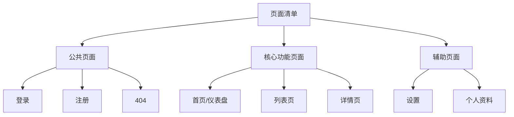
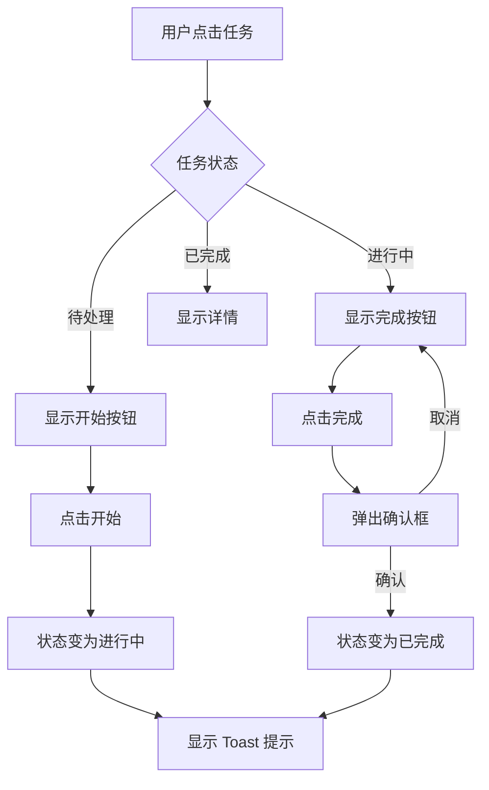
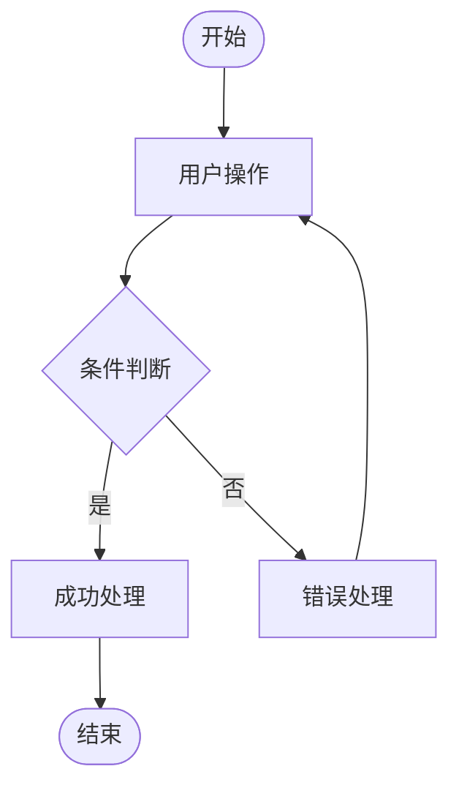
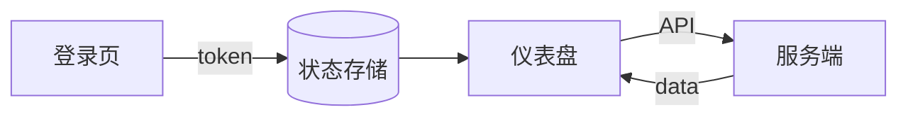
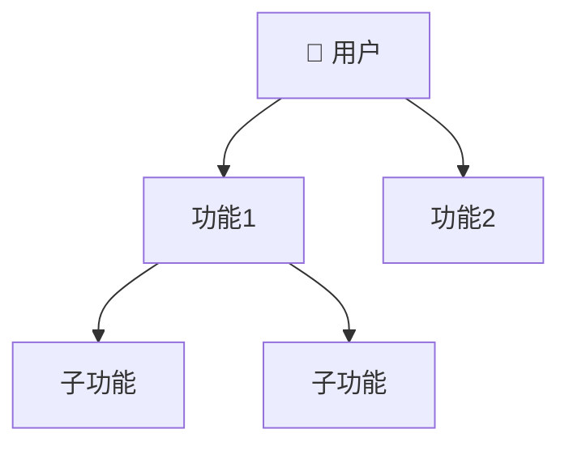

# UI Designer

将 PRD 转化为完整的 UI 设计规范文档，包含设计原则、色彩体系、页面线框图、交互规范等，为前端开发提供清晰的设计指导。

## 设计原则

1. **文档化设计** — 以 Markdown 文档形式输出，便于版本管理和协作
2. **ASCII 线框图** — 使用字符绘制线框图，无需设计工具即可表达布局
3. **Mermaid 流程图** — 用图表展示交互流程和数据流
4. **灵活组织** — 支持单文档或多文档拆分输出

## 输入要求

### 必需输入
- **PRD 文档** — 包含功能模块和页面清单

### 可选输入
- **设计系统配置** — `.design-system.yaml` 文件
- **品牌规范** — 已有的品牌色彩、字体等

## 设计系统配置

支持读取项目根目录下的 `.design-system.yaml`：

```yaml
# .design-system.yaml 示例
brand:
  name: "ProductName"
  primary_color: "#6366F1"
  secondary_color: "#EC4899"
  
colors:
  gray:
    50: "#F9FAFB"
    100: "#F3F4F6"
    500: "#6B7280"
    900: "#111827"
  success: "#10B981"
  warning: "#F59E0B"
  error: "#EF4444"
  
typography:
  font_family: "Inter, system-ui, sans-serif"
  font_family_mono: "JetBrains Mono, monospace"
  base_size: 16px
  scale_ratio: 1.25
  
spacing:
  base_unit: 4px
  scale: [0, 1, 2, 3, 4, 6, 8, 12, 16, 24, 32, 48, 64]
  
borders:
  radius_sm: 4px
  radius_md: 8px
  radius_lg: 12px
  radius_full: 9999px
  
shadows:
  sm: "0 1px 2px rgba(0,0,0,0.05)"
  md: "0 4px 6px rgba(0,0,0,0.1)"
  lg: "0 10px 15px rgba(0,0,0,0.1)"
  
breakpoints:
  sm: 640px
  md: 768px
  lg: 1024px
  xl: 1280px
```

如存在此文件，Skill 会自动读取并应用。

## 工作流程

### 阶段 1：读取 PRD

1. 读取 PRD 文档，理解产品功能
2. 识别目标用户群体
3. 梳理页面清单

**输出：** 产品理解总结 + 页面清单

### 阶段 2：设计风格定位

与用户讨论确定整体风格：

| 维度 | 选项示例 |
|------|----------|
| 整体风格 | 简约 / 活泼 / 专业 / 科技感 |
| 视觉密度 | 宽松 / 适中 / 紧凑 |
| 色彩倾向 | 明亮 / 柔和 / 深色 |
| 圆角风格 | 直角 / 小圆角 / 大圆角 |

**关键问题：**
- 产品的目标用户是什么人群？
- 希望给用户什么样的感觉？
- 有没有参考的设计风格？

**输出：** 设计风格定位描述

### 阶段 3：色彩方案

确定色彩体系：

| 色彩类型 | 说明 | 示例 |
|----------|------|------|
| 主色 | 品牌主色调 | #6366F1 (Indigo) |
| 辅色 | 强调色 | #EC4899 (Pink) |
| 中性色 | 文字/背景 | Gray 50-900 |
| 语义色 | 成功/警告/错误 | Green/Yellow/Red |

**关键问题：**
- 有没有品牌色？
- 偏好什么色系？
- 是否需要深色模式？

**输出：** 完整色彩规范

### 阶段 4：页面清单确认

梳理所有需要设计的页面：



**输出：** 确认的页面清单 + 优先级

### 阶段 5：核心页面设计

逐个设计关键页面，每个页面包含：

1. **ASCII 线框图** — 布局结构
2. **交互说明** — 用户操作和反馈
3. **Mermaid 流程图** — 复杂交互的流程

**ASCII 线框图示例（详细版）：**

```
┌─────────────────────────────────────────────────────────┐
│ ┌─────┐                              🔔  👤 用户名 ▼   │ ← Header h:64px
│ │LOGO │    Dashboard                                    │
│ └─────┘                                                 │
├────────────┬────────────────────────────────────────────┤
│            │                                            │
│  📊 概览   │  ┌──────────┐ ┌──────────┐ ┌──────────┐   │ ← 统计卡片
│  ───────   │  │ 总用户   │ │ 活跃用户 │ │ 今日新增 │   │   gap: 24px
│  📋 任务   │  │  1,234   │ │   892    │ │    56    │   │
│  👥 团队   │  └──────────┘ └──────────┘ └──────────┘   │
│  📈 统计   │                                            │
│  ⚙️ 设置   │  ┌────────────────────────────────────┐   │ ← 主内容区
│            │  │                                    │   │
│            │  │          图表区域                  │   │
│            │  │                                    │   │
│  ────────  │  └────────────────────────────────────┘   │
│  ❓ 帮助   │                                            │
│  🚪 退出   │  ┌────────────────────────────────────┐   │ ← 列表区域
│            │  │  最近任务                     更多 →│   │
│ ↑          │  │  ☑ 任务1        已完成    2h前   │   │
│ Sidebar    │  │  ☐ 任务2        进行中    1h前   │   │
│ w: 240px   │  │  ☐ 任务3        待处理    30m前  │   │
│            │  └────────────────────────────────────┘   │
└────────────┴────────────────────────────────────────────┘
```

**交互流程图示例：**



### 阶段 6：组件抽象

从页面设计中提取复用组件：

| 组件类型 | 组件列表 |
|----------|----------|
| 基础组件 | Button, Input, Select, Checkbox, Radio |
| 反馈组件 | Toast, Modal, Alert, Loading |
| 数据展示 | Card, Table, List, Badge, Avatar |
| 导航组件 | Sidebar, Header, Tabs, Breadcrumb |
| 布局组件 | Container, Grid, Stack |

每个组件定义：
- 变体（variants）
- 尺寸（sizes）
- 状态（states）

### 阶段 7：交互规范

定义交互反馈和动效：

| 交互类型 | 规范 |
|----------|------|
| 按钮点击 | 轻微缩放 + 颜色变化，duration: 150ms |
| 页面切换 | 淡入淡出，duration: 200ms |
| 弹窗出现 | 从下往上滑入 + 淡入，duration: 300ms |
| 加载状态 | Skeleton 或 Spinner |
| 成功反馈 | Toast 绿色，停留 3s |
| 错误反馈 | Toast 红色，停留 5s |

**状态定义：**

```
Normal → Hover → Active → Disabled
   ↓
Focus (键盘导航)
```

### 阶段 8：生成文档

确认输出方式：

**单文档模式：**
```
ui-design.md          # 所有内容在一个文件
```

**多文档模式：**
```
ui-design/
├── 00-overview.md        # 概述 + 设计原则
├── 01-colors.md          # 色彩规范
├── 02-typography.md      # 字体规范
├── 03-spacing.md         # 间距系统
├── 04-components.md      # 组件规范
├── 05-layout.md          # 布局系统
├── 06-pages/             # 页面设计
│   ├── auth.md           # 登录/注册
│   ├── dashboard.md      # 仪表盘
│   ├── list.md           # 列表页
│   └── detail.md         # 详情页
├── 07-interactions.md    # 交互规范
└── README.md             # 索引文件
```

询问用户选择哪种输出方式。

## 输出文档结构（单文档版）

```markdown
# [产品名称] UI 设计规范

## 1. 设计原则

### 1.1 设计理念
[整体设计理念描述]

### 1.2 设计原则
- **一致性** — 相同功能保持相同样式
- **简洁性** — 减少视觉噪音，突出核心内容
- **可访问性** — 满足 WCAG 2.1 AA 标准

## 2. 色彩规范

### 2.1 主色调

| 名称 | 色值 | 用途 |
|------|------|------|
| Primary | #6366F1 | 主要按钮、链接、强调 |
| Primary Light | #818CF8 | Hover 状态 |
| Primary Dark | #4F46E5 | Active 状态 |

### 2.2 中性色

| 级别 | 色值 | 用途 |
|------|------|------|
| Gray-50 | #F9FAFB | 页面背景 |
| Gray-100 | #F3F4F6 | 卡片背景 |
| Gray-500 | #6B7280 | 次要文字 |
| Gray-900 | #111827 | 主要文字 |

### 2.3 语义色

| 类型 | 色值 | 用途 |
|------|------|------|
| Success | #10B981 | 成功状态 |
| Warning | #F59E0B | 警告状态 |
| Error | #EF4444 | 错误状态 |
| Info | #3B82F6 | 信息提示 |

## 3. 字体规范

### 3.1 字体家族

​```css
--font-sans: 'Inter', system-ui, sans-serif;
--font-mono: 'JetBrains Mono', monospace;
​```

### 3.2 字号层级

| 级别 | 字号 | 行高 | 用途 |
|------|------|------|------|
| xs | 12px | 16px | 辅助文字 |
| sm | 14px | 20px | 次要文字 |
| base | 16px | 24px | 正文 |
| lg | 18px | 28px | 小标题 |
| xl | 20px | 28px | 标题 |
| 2xl | 24px | 32px | 页面标题 |

## 4. 间距系统

### 4.1 基础单位

基础单位：**4px**

### 4.2 间距规范

| Token | 值 | 用途 |
|-------|-----|------|
| space-1 | 4px | 紧凑间距 |
| space-2 | 8px | 小间距 |
| space-3 | 12px | 默认间距 |
| space-4 | 16px | 中等间距 |
| space-6 | 24px | 大间距 |
| space-8 | 32px | 区块间距 |

## 5. 组件规范

### 5.1 Button

​```
┌─────────────────┐    ┌─────────────────┐    ┌─────────────────┐
│    Primary      │    │   Secondary     │    │    Outline      │
│   bg: primary   │    │   bg: gray-100  │    │  border: gray   │
│   text: white   │    │   text: gray    │    │   text: gray    │
└─────────────────┘    └─────────────────┘    └─────────────────┘

尺寸：
- sm: h-32px, px-12px, text-sm
- md: h-40px, px-16px, text-base
- lg: h-48px, px-24px, text-lg

状态：
- Normal → Hover (亮度+10%) → Active (亮度-10%) → Disabled (opacity: 0.5)
​```

### 5.2 Input

​```
┌────────────────────────────────────┐
│ Label                              │
├────────────────────────────────────┤
│ Placeholder text              │ ← h: 40px, border: gray-300
└────────────────────────────────────┘
  Helper text or error message       ← text-sm, text-gray-500

状态：
- Normal: border-gray-300
- Focus: border-primary, ring-2
- Error: border-error, text-error
- Disabled: bg-gray-100, cursor-not-allowed
​```

## 6. 页面结构

### 6.1 布局系统

​```
┌─────────────────────────────────────────────────┐
│                    Header (h: 64px)             │
├──────────┬──────────────────────────────────────┤
│          │                                      │
│ Sidebar  │              Main Content            │
│ (w: 240) │           (flex: 1, p: 24px)         │
│          │                                      │
└──────────┴──────────────────────────────────────┘
​```

### 6.2 响应式断点

| 断点 | 宽度 | 布局变化 |
|------|------|----------|
| sm | 640px | 单列布局 |
| md | 768px | Sidebar 收起 |
| lg | 1024px | 完整布局 |
| xl | 1280px | 最大内容宽度 |

## 7. 页面设计

### 7.1 登录页

[ASCII 线框图]

**交互流程：**

​```mermaid
flowchart TD
    A[进入登录页] --> B[输入邮箱]
    B --> C[输入密码]
    C --> D[点击登录]
    D --> E{验证}
    E -->|成功| F[跳转首页]
    E -->|失败| G[显示错误]
    G --> B
​```

### 7.2 仪表盘

[ASCII 线框图]

## 8. 交互规范

### 8.1 动效时长

| 类型 | 时长 | 缓动函数 |
|------|------|----------|
| 快速反馈 | 150ms | ease-out |
| 常规过渡 | 200ms | ease-in-out |
| 复杂动画 | 300ms | ease-in-out |

### 8.2 反馈规范

| 场景 | 反馈方式 |
|------|----------|
| 按钮点击 | 颜色变化 + 轻微缩放 |
| 表单提交中 | 按钮 Loading 状态 |
| 操作成功 | Toast 提示 + 数据更新 |
| 操作失败 | Toast 错误 + 保留表单数据 |

### 8.3 用户-产品关系图

​```mermaid
graph TD
    User[👤 用户] --> Auth[🔐 认证系统]
    Auth --> Dashboard[📊 仪表盘]
    Dashboard --> Tasks[📋 任务管理]
    Dashboard --> Team[👥 团队]
    Dashboard --> Stats[📈 统计]
    Tasks --> TaskDetail[任务详情]
    Team --> Members[成员管理]
​```

---

## META（供其他 Skill 解析）

​```yaml
design_system:
  name: [产品名称]
  version: "1.0"
  
  colors:
    primary: "#6366F1"
    primary_light: "#818CF8"
    primary_dark: "#4F46E5"
    secondary: "#EC4899"
    gray:
      50: "#F9FAFB"
      100: "#F3F4F6"
      500: "#6B7280"
      900: "#111827"
    success: "#10B981"
    warning: "#F59E0B"
    error: "#EF4444"
    
  typography:
    font_sans: "Inter, system-ui, sans-serif"
    font_mono: "JetBrains Mono, monospace"
    sizes:
      xs: { size: "12px", line_height: "16px" }
      sm: { size: "14px", line_height: "20px" }
      base: { size: "16px", line_height: "24px" }
      lg: { size: "18px", line_height: "28px" }
      xl: { size: "20px", line_height: "28px" }
      
  spacing:
    base: 4px
    scale: [4, 8, 12, 16, 24, 32, 48, 64]
    
  borders:
    radius:
      sm: 4px
      md: 8px
      lg: 12px
      full: 9999px
      
  breakpoints:
    sm: 640px
    md: 768px
    lg: 1024px
    xl: 1280px
    
  components:
    - name: Button
      variants: [primary, secondary, outline, ghost]
      sizes: [sm, md, lg]
    - name: Input
      variants: [default, error]
      sizes: [sm, md, lg]
    - name: Card
      variants: [default, bordered]
      
  pages:
    - name: login
      path: /login
      priority: P0
    - name: register
      path: /register
      priority: P0
    - name: dashboard
      path: /dashboard
      priority: P0
    - name: tasks
      path: /tasks
      priority: P0
​```
```

## 动态脚本生成

根据设计讨论结果，可动态生成以下配置文件：

### Tailwind CSS 配置

```javascript
// tailwind.config.js（根据色彩/间距规范生成）
module.exports = {
  theme: {
    colors: {
      primary: {
        DEFAULT: '#6366F1',
        light: '#818CF8',
        dark: '#4F46E5',
      },
      // ... 其他颜色
    },
    spacing: {
      1: '4px',
      2: '8px',
      // ... 其他间距
    },
  },
}
```

### CSS 变量

```css
/* variables.css（根据设计规范生成）*/
:root {
  --color-primary: #6366F1;
  --color-primary-light: #818CF8;
  --font-sans: 'Inter', system-ui, sans-serif;
  --space-1: 4px;
  /* ... */
}
```

## Mermaid 图规范

### 交互流程图

展示用户操作的完整流程：



### 数据流图

展示页面间的数据流转：



### 用户-产品关系图

展示用户与产品功能的关系：



## 与其他 Skill 的衔接

| 上游 Skill | 输入数据 |
|------------|----------|
| prd-designer | PRD.META.modules, 信息架构 |

| 下游 Skill | 输出数据 |
|------------|----------|
| task-planner | META.pages, META.components |
| spec-designer | META.design_system |

## 注意事项

1. **先整体后细节** — 先确定整体风格，再设计具体页面
2. **保持一致性** — 组件样式在全文档保持一致
3. **考虑响应式** — 每个页面考虑不同屏幕尺寸
4. **文档可拆分** — 复杂项目建议拆分多个文档
5. **ASCII 图清晰** — 线框图要能清晰表达布局意图
6. **交互完整** — 每个操作都要有对应的反馈
